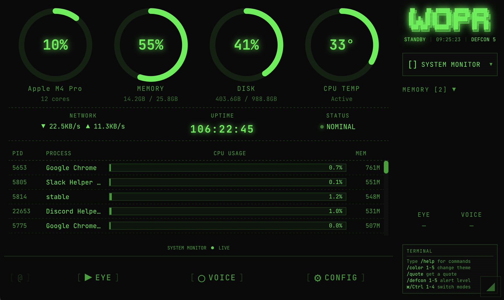
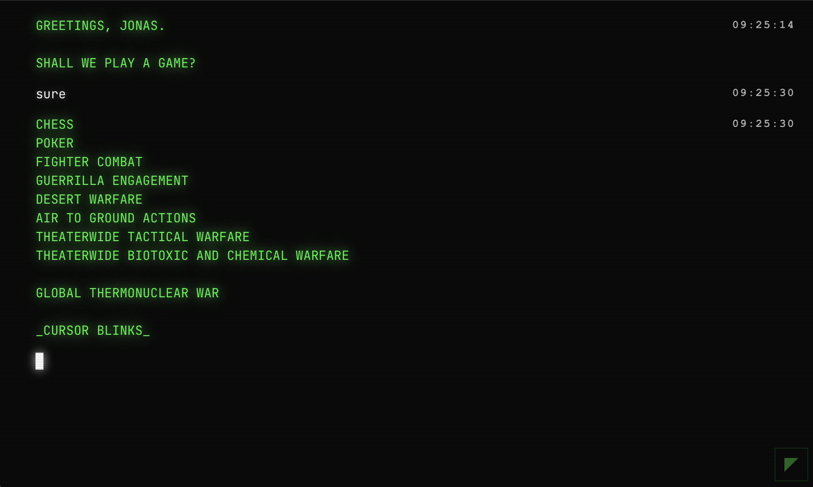

# WOPR

> "Shall we play a game?"



WOPR is a retro styled AI assistant that lives on a secondary touchscreen display. It observes your primary screen activity and provides contextual help, recommendations, and quick answers with a nostalgic green on black terminal aesthetic.

The default AI persona is named **Joshua** (a WarGames reference), but you can configure this to any name you prefer.

## Features

**Screen Observation**
Captures your primary display, uses OCR to extract text, and detects what application you're using.

**Voice Activation**
Say "Joshua" (or your custom wake word) to ask questions. Responses appear as popup overlays and auto dismiss.

**Plugin System**
Each application has its own plugin with detection rules, context extraction, and AI guidelines.

**Privacy Controls**
Large touch buttons let you disable screen capture or microphone instantly. Auto pauses for banking sites and password fields.

## Display Modes

| Mode | Description |
|------|-------------|
| AI Assistant | Core experience: observes screen, provides contextual help |
| System Monitor | Real time hardware stats with retro gauges |
| Music Player | Control Spotify, Apple Music, and other apps |
| Pomodoro Timer | Focus timer with calendar integration |
| Chat Hub | Unified notifications for Discord, Slack, iMessage |
| Control Deck | Customizable button grid for macros and app launching |



## Tech Stack

| Component | Technology |
|-----------|------------|
| App Framework | Tauri (Rust + WebView) |
| Frontend | Svelte |
| Screen Capture | macOS ScreenCaptureKit |
| OCR | Apple Vision Framework |
| Voice | Whisper or Web Speech API |
| AI | Ollama (local) or Claude API |

## Getting Started

```bash
npm install
npm run tauri dev
```

## Name Origin

**WOPR** stands for War Operation Plan Response, the military supercomputer from the 1983 film WarGames. In the movie, WOPR was given the human name "Joshua" by its creator Dr. Falken.

```
╔═══════════════════════════════════════════╗
║                                           ║
║   "Shall we play a game?"                 ║
║                              ~ Joshua     ║
║                                           ║
╚═══════════════════════════════════════════╝
```
